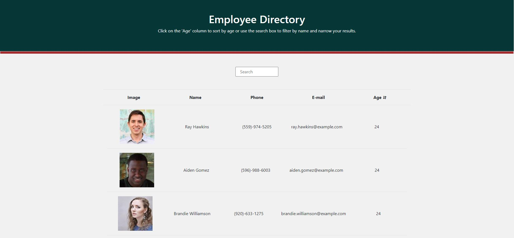

# Employee Directory


## Table of Content

  - [Description](#description)

  - [Installation](#installation)

  - [Usage](#usage)

  - [Licence](#licence)

  - [Contributing](#contributing)

  - [Questions](#questions)

 ### Description

 Employee Directory is an application that allows a user to view the entire employee directory at once so that they can have quick access to employee information. Users are able to filter the employees by name using the search box and sort employees by their age by clicking on the age column.

 The app is built using React and utilizes the [Random User API](https://randomuser.me/) to generate employee data.

 The live app can be accessed [here](https://caymanh.github.io/employee-directory/).

 <p align="center">
    
</p>
 

### Installation

The application can be installed by using the following command: 

```bash
git clone https://github.com/caymanh/employee-directory.git
```

### Usage

The application can be invoked by using the following commands: 

```bash
npm install
npm start
```

### Licence

This application is covered by the [MIT](https://choosealicense.com/licenses/mit/) licence.

### Contributing

Pull requests are welcome. For major changes, please open an issue first to discuss what you would like to change.

### Questions

Please contact me if you have any questions regarding the application:

[Github](https://github.com/caymanh)

[Email](mailto:hengcayman@gmail.com)